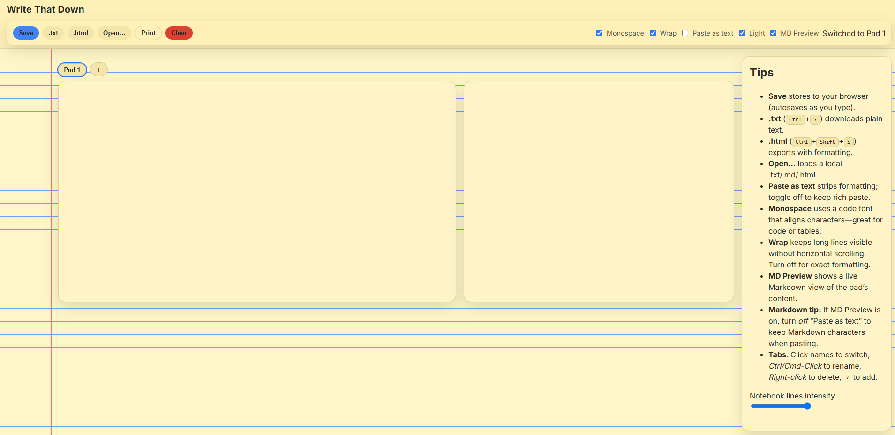
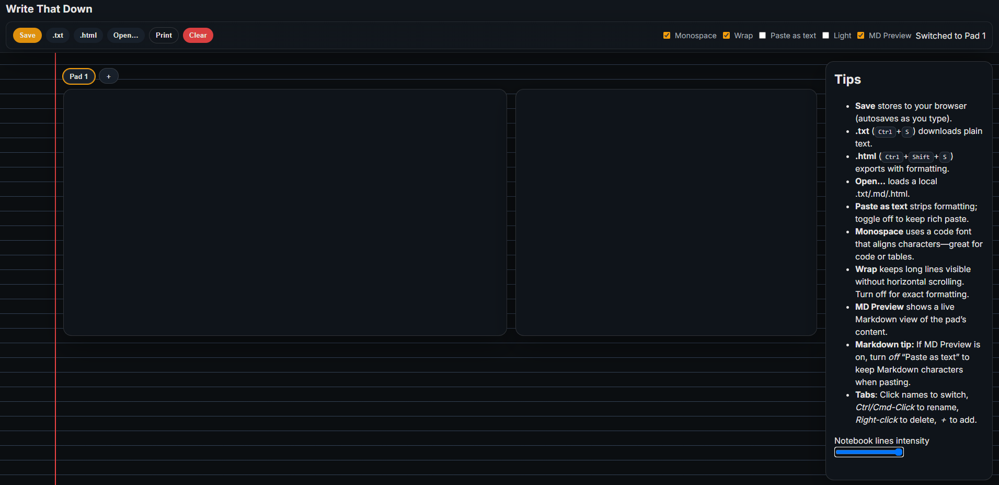

# 📝 Write That Down

A fast, offline-friendly scratchpad inspired by  
`data:text/html,<html contenteditable>`, rebuilt as a stylish notepad

> **Status:** MVP complete — all core features working and polished.  
> Next: overflow tabs, export/import, markdown upgrades.

---

## ✨ Features

- 🧠 **Autosaving editor** — type freely; your notes persist in `localStorage`
- 🗂 **Multiple pads** — add, rename, delete, or switch tabs effortlessly
- 💾 **Download** notes as `.txt` or `.html`
- 📂 **Open** existing `.txt`, `.md`, or `.html` files into the pad
- 🔤 **Paste-as-text** toggle to strip formatting (great for copying from web)
- 🔠 **Monospace + Wrap** toggles for dev-style editing
- 📏 **Notebook line intensity** slider — customize your page background
- 🧩 **Markdown Preview** panel (live, minimal parser)
- ⚙️ **Service worker** — runs entirely offline once loaded
- 🌞 **Light mode** 
- 🌚 **Dark mode**

---

## 🖥 Tech Stack

- **Static HTML/CSS/JS**
- **LocalStorage** for pads and UI state
- **Service Worker** (`sw.js`) caches app shell for offline use
- **Zero dependencies**

---

## ⌨️ Keyboard Shortcuts

| Action | Shortcut |
|---------|-----------|
| Save as `.txt` | **Ctrl/Cmd + S** |
| Save as `.html` | **Ctrl/Cmd + Shift + S** |
| New pad | **Ctrl/Cmd + N** |
| Toggle Markdown preview | **Ctrl/Cmd + B** |

### Tabs
- Click tab → switch pad  
- **Ctrl/Cmd + Click** → rename  
- **Right-click** → delete  
- **＋** → add new pad  
- Overflow menu (coming soon) shows hidden pads when many are open

---

## 🧾 Markdown Tips

- Toggle **MD Preview** to view formatted content side-by-side  
- Supported: headings, bold/italic, inline/fenced code, unordered lists, links  
- Coming soon: ordered lists, blockquotes, tables  
- 🧠 *Tip:* if MD Preview is **on**, turn **off “Paste as text”** to preserve Markdown characters

---

## 🔭 Roadmap / To-Do

### 🎯 Core Enhancements
- [ ] Overflow tab menu (rename/delete from dropdown)  
- [ ] Export / Import all pads as `.json` (backup + restore)  
- [ ] Download-all option (`.zip` of pads)  
- [ ] Ordered lists, blockquotes, and tables in Markdown  
- [ ] Optional code syntax highlighting (no runtime libs)  

### 🎨 Visual / UX
- [ ] Add hover/focus rings for accessibility  
- [ ] Paper texture toggle for added realism  
- [ ] More theme presets
- [ ] Slight animation / transition polish for buttons and tabs  

---

## 📸 Screenshots

| Light Mode | Dark Mode |
|-------------|------------|
|  |  |